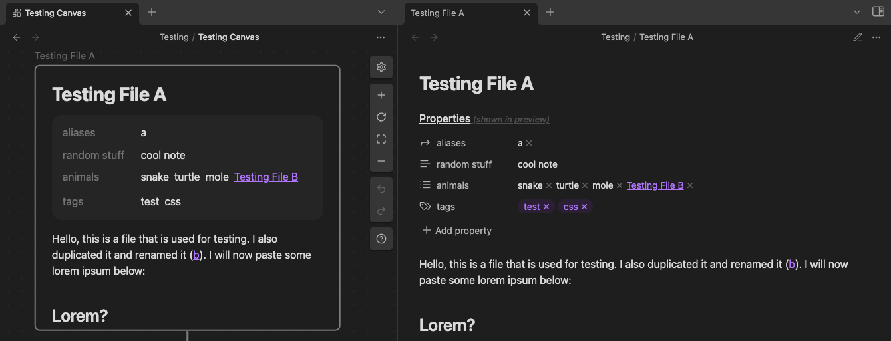

## What is this all about?

I have been using [Obsidian](https://obsidian.md) for quite a while now, and I have found some minor inconveniences along the way. Whenever I have found a solution to one of these issues, I usually went ahead and created a CSS snippet, or even a plugin, with the intent of using it personally in my vault.

However, I have arrived at the conclusion that some of my solutions could benefit the community as well, so I have decided to create [this repository](https://github.com/KiljanK/obsidian-k-css-snippets) for sharing them and to track any future development. I have named the snippets in a way where they will be grouped together nicely in the snippet list, but feel free to change the names to your liking, should you decide to use them.

## So what do these Snippets do?

#### frontmatter-dataview-in-preview
Sadly, it isn't possible to look at the YAML Frontmatter of an Obsidian document in previews and/or embeds (unless i've missed something). This has always annoyed me, because I would benefit greatly from having the ability to look at the Frontmatter of the associated file when hovering over a link, or when embedding a file into a canvas.

There have been [forum posts](https://forum.obsidian.md/t/display-front-matter-on-hover-preview/19004) trying to address this issue, but while they offer great, minimalistic solutions, I never really liked the look of the YAML codeblock that Obsidian just inserts into previews by default. So I figured I'd create a simple [Dataview](https://github.com/blacksmithgu/obsidian-dataview) Query to list the Frontmatter properties and whip up some accompanying CSS to style it (and to only make it visible in the places where I couldn't see the default Frontmatter anyways)

Whenever the snippet is enabled and the Query is present at the beginning of the file, it should be rendered in the hover-previews and canvas-embeds. Its presence is also noted in the title of the _"Properties"_ section.

You can also selectively display the properties, if you add list properties called `d-f-show` and/or `d-f-hide` to the file's Frontmatter.

For a more detailed guide of how to install/use this feature, refer to the specific [README](frontmatter-dataview-in-preview/README.md) file.

#### highlights-and-links
I simply disliked the way that links and Markdown highlights look in obsidian. There's not much more to it. The top part of the image shows how highlights looked previously, the bottom part shows how it looks with the snippet enabled.

For a more detailed guide of how to install/use this feature and style the default link colors, refer to the specific [README](highlights-and-links/README.md) file.

#### checkboxes
Obsidian provides the ability to style checkboxes based on their content. Many themes provide various options, but i have found the styling of the in-progress checkboxes to be lacking. This is why i have created styling for a checkbox that is only halfway filled in.

For a more detailed guide of how to install/use this feature, refer to the specific [README](checkboxes/README.md) file.

## Why not just create a Plugin?
I am not really all that satisfied with the current state of my TypeScript code and these changes are minor enough to work as CSS snippets and Markdown templates.

## Will there be other Snippets?
If I encounter more problems and decide to make custom solutions for them, I'll try to share them here. But I won't go actively looking for problems to solve, since i'm pretty happy with the current state of obsidian and its plugin ecosystem, aside from the previously mentioned issues.

However, feel free to fork this project to create your own variations. I don't know much about common open-source practices, but I've added (what feels like) a pretty generic [License](LICENSE) to this repository.